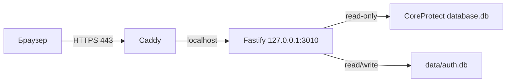

# ТЗ: авторизация и защита CoreProtect API
## 1. Цель
Добавить авторизацию для публичного сайта по домену. Главная задача — не скрытие CoreProtect-данных, а запрет анонимных и чрезмерных запросов к живой SQLite-базе.
Ожидается около 10 модераторов. CoreProtect DB остаётся строго read-only; данные авторизации хранятся отдельно.
## 2. Принятые решения
- Вход: email и пароль.
- Регистрации и восстановления пароля по email нет.
- Пользователей создаёт администратор локальным CLI.
- Сессия сохраняется после закрытия браузера.
- Срок сессии по умолчанию — 90 дней от момента входа (абсолютный TTL); значение настраивается. Активность не продлевает срок за пределы `created_at + sessionMaxAgeDays`.
- Выход: кнопка `Вийти`, отзыв сессии, отключение пользователя, смена пароля или истечение 90 дней.
- 2FA, VPN и сложные роли не входят в первую версию.
- Публичный HTTPS принимает Caddy; Fastify слушает только `127.0.0.1:3010`.
- Ограничения реализуются на backend до выполнения SQL; frontend не считается защитой.

## 3. Схема

Публичны только порты `80/443`. Порт `3010` не пробрасывается и блокируется внешним Windows Firewall. Крупный DDoS, компрометация Windows и злонамеренный авторизованный модератор не входят в гарантии первой версии.
## 4. Auth-хранилище
Создать отдельную SQLite-базу `data/auth.db`.
`auth_users`:
- `id`, уникальный нормализованный `email`;
- `password_hash` (Argon2id), `enabled`;
- `created_at`, `updated_at`, `password_changed_at`, `last_login_at`.
`auth_sessions`:
- `id`, unique `token_hash`, `user_id`;
- `created_at`, `last_seen_at`, `expires_at`, `revoked_at`;
- опционально `created_ip`, `user_agent` для диагностики.
Session token генерируется криптографически и содержит не менее 256 бит энтропии. В cookie хранится token, в БД — только его SHA-256 hash. Сессию не привязывать к IP.
Истёкшие/отозванные сессии очищать при старте и затем не чаще раза в час, а не при каждом запросе.
Все временные поля auth DB хранятся как целые Unix seconds UTC.
## 5. Пароли и CLI
- Argon2id с параметрами, подходящими машине сервера.
- Минимальная длина пароля — 8 символов; длинные пароли разрешены.
- Пароль не обрезать, не менять регистр, не сохранять и не журналировать.
- Для неизвестного email выполнять фиктивную проверку hash против timing enumeration.
CLI должен уметь:
- создать и вывести список пользователей без hash;
- изменить пароль;
- включить/отключить пользователя;
- отозвать все сессии пользователя.
Пароль вводится интерактивно дважды без отображения и не передаётся аргументом командной строки. Добавить понятные npm scripts в `server/package.json`.
Смена пароля и отключение пользователя в одной транзакции выставляют `revoked_at` всем его активным сессиям. Повторное включение не восстанавливает отозванные сессии.
## 6. Auth API и cookie
Публичные endpoints:
- `POST /api/auth/login`;
- `GET /api/auth/me` (`401` без сессии);
- статические файлы формы входа;
- опциональный минимальный health endpoint.
`POST /api/auth/login` принимает только малый JSON body с `email` и `password`. Email нормализуется через `trim().toLowerCase()`. Неизвестный email, отключённый аккаунт и неверный пароль получают одинаковый ответ: `Неправильна електронна пошта або пароль`.
Cookie `cpmv_session`:
- `HttpOnly`, `SameSite=Strict`, `Path=/`;
- `Secure` обязателен в production;
- host-only, без `Domain`;
- persistent `Max-Age` согласно сроку сессии.
`last_seen_at` обновлять не чаще раза в `sessionRenewAfterDays` (по умолчанию 7 дней) только для диагностики активности. `expires_at` и срок cookie при этом не продлеваются: обе границы остаются равны абсолютному сроку от момента входа. Для локальной разработки разрешён явно заданный `secureCookies: false`.
`POST /api/auth/logout` требует сессию и CSRF-защиту, отзывает серверную сессию и очищает cookie; повторный вызов безопасен.
Общий Fastify guard возвращает `401` до SQL, если token отсутствует/неверен, сессия истекла/отозвана либо пользователь отключён.

При успешном login и `GET /api/auth/me` сервер возвращает объект пользователя и CSRF token. CSRF token хранится frontend только в памяти вкладки и передаётся в заголовке `X-CSRF-Token`; в auth DB хранится только его SHA-256 hash. Повторный logout с отсутствующей, истёкшей или уже отозванной cookie возвращает `204`, повторно очищает cookie и не раскрывает состояние прежней сессии.
## 7. Закрытые маршруты
Авторизация обязательна для всех `/api/*`, кроме явно публичных auth endpoints, включая:
- `/api/config`, `/api/meta`, `/api/meta/refresh`;
- `/api/query-plan`, `/api/query`, `/api/aggregate`;
- `/api/event/*`, `/api/bluemap/*`;
- `/api/sync/status`, `/api/sync/start`.
Скрытие кнопок frontend без backend guard недопустимо.
## 8. Ограничение нагрузки
Rate limit учитывает IP из Caddy только при доверенном localhost proxy. Произвольному клиентскому `X-Forwarded-For` не доверять.
### 8.1. Login
- До 5 неудачных попыток за 15 минут для `IP + email`.
- До 10 попыток за 15 минут для IP независимо от email.
- После повторных ошибок — задержка; при лимите `429` и `Retry-After`.
- Пароль не включать в ключи и логи.
### 8.2. Категории API
- Лёгкие: `/auth/me`, `/config`, `/meta`, `/event/*`, `/sync/status`.
- Тяжёлые: `/query-plan`, `/query`, `/aggregate`, `/meta/refresh`, `/sync/start`.
- BlueMap получает отдельный высокий лимит, чтобы pan/zoom работали нормально.
Настраиваемые стартовые значения:
- лёгкие: 120/мин на пользователя, 240/мин на IP;
- тяжёлые: 30/мин на пользователя;
- refresh/start: 6/мин на пользователя;
- BlueMap: 600/мин на пользователя плюс лимит одновременных upstream fetch.
Лимиты проверить на штатном tiled scan и при необходимости скорректировать.

Страницы детализации `/api/query` имеют отдельный стартовый лимит 120/мин на пользователя и не расходуют общий лимит 30/мин для остальных тяжёлых маршрутов. Rate limit использует фиксированные окна в памяти одного процесса и сбрасывается при его перезапуске.
### 8.3. Одновременные SQL-операции
Из-за синхронного `better-sqlite3` одного rate limit недостаточно:
- одновременно выполнять не более одной тяжёлой операции; это соответствует последовательному исполнению синхронного `better-sqlite3` в основном Node.js-процессе;
- держать ограниченную FIFO-очередь максимум из 10 ожидающих тяжёлых запросов;
- каждый ожидающий запрос может находиться в очереди не более 30 секунд;
- при заполненной очереди или истечении ожидания немедленно возвращать `503`, `Retry-After: 2` и машинный код `GLOBAL_BUSY`;
- frontend показывает `GLOBAL_BUSY` как небольшую нефатальную ошибку в строке состояния, сохраняет уже загруженную карту и останавливает текущий scan без автоматического повтора;
- место выполнения и место в очереди освобождать в `finally`, включая ошибку SQL и закрытие HTTP-соединения;
- лёгкие auth endpoints не блокировать;
- отклонять запрос до SQL: HTTP abort не прерывает уже запущенный синхронный запрос.

Несколько логических scan одного пользователя, включая scan из разных вкладок, разрешены. Каждый Apply создаёт случайный frontend `scanId`, передаваемый во всех его запросах заголовком `X-CPMV-Scan-Id`; идентификатор нужен для диагностики, логов и независимой отмены на frontend, но backend не делает его глобальной блокировкой. Параллельные `/api/query` разных и одного scan проходят через общую ограниченную очередь.
### 8.4. Валидация
- Сервер ограничивает `limit`, `pageSize`, tile size, координаты и время.
- Ограничить число и длину glob-паттернов, query string и request body.
- Проверять snapshot/cursor до SQL.
- Использовать bound parameters; не конкатенировать пользовательский ввод в SQL.
- Клиент не может повысить серверные лимиты параметрами запроса.

IP из `X-Forwarded-For` учитывается только если непосредственное соединение пришло с доверенного loopback proxy `127.0.0.1` или `::1`. В остальных случаях заголовок игнорируется. `Origin: null` и изменяющий запрос без `Origin` отклоняются. Login принимает `application/json` с необязательным `charset`; другой content type получает `415`.
## 9. CORS, CSRF и HTTPS
- Удалить production-заголовки `Access-Control-Allow-Origin: *` и `Access-Control-Allow-Headers: *`.
- Frontend и API работают same-origin; Vite dev использует proxy `/api`.
- Для `POST/PUT/PATCH/DELETE` проверять точное совпадение `Origin` с `publicOrigin`.
- Использовать `SameSite=Strict` + Origin check + CSRF token для logout и будущих изменяющих операций.
- Login защищается Origin check, JSON content type и rate limit.
- Caddy перенаправляет HTTP на HTTPS, ограничивает body и проксирует на localhost.
- Добавить HSTS после проверки HTTPS, `nosniff`, `Referrer-Policy`, `Permissions-Policy` и совместимый с Pixi/BlueMap CSP с `frame-ancestors 'none'`.
- Не включать HSTS `includeSubDomains` без отдельного подтверждения.

Строгий production-режим определяется значением `auth.secureCookies: true`: `publicOrigin` обязан быть валидным HTTPS origin без path/query/hash, а Fastify host — loopback (`127.0.0.1` или `::1`), иначе сервер не запускается. При `secureCookies: false` разрешается локальная HTTP-разработка и отдельный `developmentOrigin` (по умолчанию `http://127.0.0.1:5173`) для Vite proxy. Агент формирует и тестирует CSP и остальные security headers по фактическим требованиям Vite/Pixi отдельно для production и development.
## 10. Frontend
При старте сначала вызвать `/api/auth/me`:
- `200` — запуск карты;
- `401` — форма входа;
- сетевой сбой — отдельная ошибка, не «неверный пароль».
Форма на украинском: `Електронна пошта`, `Пароль`, `Увійти`; использовать `autocomplete="username"` и `current-password`, блокировать повторный submit.
Форма входа располагается на отдельной статической странице `/login.html`. При `401` приложение переходит на `/login.html`; после успешного входа выполняется переход на `/`. Если авторизованный пользователь открывает `/login.html`, успешный `/api/auth/me` перенаправляет его на `/`.
После входа показывать email и кнопку `Вийти`. При `401` от любого API остановить scan, очистить runtime-данные карты, показать login и не запускать бесконечный retry.
Динамические данные из CoreProtect/API/email вставлять через `textContent`/DOM API. Не интерполировать их в `innerHTML`; проверить `web/src/ui.ts` и `web/src/main.ts`.
## 11. Логи
Логировать успешные/неуспешные входы, IP, logout, отзыв сессий, rate limit, отказ concurrency gate и ошибки auth DB.
Не логировать пароль, password hash, session/CSRF token и Cookie header. Ограничить длину логируемого `req.url`.
## 12. Конфигурация
```json
{
  "publicOrigin": "https://map.example.com",
  "developmentOrigin": "http://127.0.0.1:5173",
  "auth": {
    "databasePath": "F:/Mine/CoreProtect-Map-Visualizer/data/auth.db",
    "sessionMaxAgeDays": 90,
    "sessionRenewAfterDays": 7,
    "secureCookies": true
  },
  "requestProtection": {
    "maxConcurrentHeavyRequests": 1,
    "maxQueuedHeavyRequests": 10,
    "heavyQueueTimeoutSeconds": 30,
    "heavyRequestsPerMinutePerUser": 30,
    "detailRequestsPerMinutePerUser": 120,
    "lightRequestsPerMinutePerUser": 120,
    "lightRequestsPerMinutePerIp": 240,
    "refreshRequestsPerMinutePerUser": 6,
    "bluemapRequestsPerMinutePerUser": 600,
    "maxConcurrentBluemapFetches": 8,
    "loginAttemptsPer15MinutesPerIdentity": 5,
    "loginAttemptsPer15MinutesPerIp": 10,
    "maxBodyBytes": 1048576,
    "maxLoginBodyBytes": 16384
  }
}
```
Все значения нормализовать и ограничить безопасными диапазонами. При `secureCookies: true` неверный `publicOrigin` или внешний Fastify host приводит к явной ошибке запуска; при `secureCookies: false` сервер явно предупреждает, что работает в режиме локальной разработки без production-cookie. `/api/config` не возвращает внутренние пути и auth/security-настройки.
Допустимые зависимости: `argon2`, `@fastify/cookie`, `@fastify/rate-limit` либо небольшая тестируемая реализация. JWT не использовать.

Остальные низкоуровневые безопасные пределы (параметры Argon2id, максимальные длины email/password/glob/query и диапазоны числовых параметров) агент выбирает по актуальным рекомендациям используемых библиотек, фиксирует централизованно и покрывает граничными тестами; отдельное согласование каждого числа не требуется. Production Argon2id-параметры нельзя молча ослаблять, а тестам разрешены отдельные быстрые параметры.
## 13. Тесты
Server unit/endpoint tests обязаны проверить:
- hash/verify, token hash, абсолютное истечение, отзыв, редкое обновление `last_seen_at` без продления TTL и очистку сессий;
- отключённого пользователя и одинаковую login-ошибку;
- `401` на защищённых маршрутах до обращения к Store/SQL;
- cookie attributes, безопасный `/auth/me`, logout и старую cookie;
- login/API rate limits и `Retry-After`;
- global concurrency gate и освобождение слота при ошибке;
- FIFO-очередь на 10 запросов, 30-секундный timeout и `503 GLOBAL_BUSY` при переполнении;
- Origin, body limit и отсутствие wildcard CORS;
- отсутствие записи renewal на каждом запросе.
Frontend tests:
- состояния `checking → login → authenticated`;
- общая login-ошибка и обработка `429`;
- остановка scan и переход на login после `401`;
- отсутствие CoreProtect-запросов до подтверждения сессии;
- `GLOBAL_BUSY` отображается только в строке состояния, сохраняет загруженные данные и останавливает текущий scan.
Тесты используют временную/in-memory auth DB, а не production DB.

## 14. Caddy и инструкция публикации
Caddy — внешний reverse proxy: он принимает публичный HTTPS, автоматически получает и обновляет TLS-сертификат домена и передаёт запросы локальному Fastify. Пользователь не обязан самостоятельно проектировать его конфигурацию.

В объём задачи входят:
- готовый `Caddyfile.example` с заменяемым доменом, reverse proxy на `127.0.0.1:3010`, перенаправлением HTTP на HTTPS, ограничением request body и согласованными security headers;
- пошаговая инструкция установки, настройки и автозапуска Caddy на Windows;
- пошаговая инструкция установки, настройки и запуска как systemd service на Linux, где будет работать сервер;
- инструкции по DNS и firewall: домен указывает на публичный IP, извне доступны только 80/443, порт 3010 закрыт;
- проверка HTTPS, redirect, cookie `Secure`, proxy IP и недоступности порта 3010 извне;
- HSTS без `includeSubDomains` и без `preload`.

Секреты, cookie и пути к базам не помещаются в `Caddyfile`. Если security headers задаются Caddy, Fastify не должен добавлять конфликтующие дубликаты.

## 15. Критерии приёмки
- Анонимный пользователь не вызывает CoreProtect API или BlueMap proxy.
- Закрытие браузера не завершает действующую сессию.
- Пароль и исходный session token не хранятся в БД.
- CLI создаёт/отключает пользователей и отзывает сессии.
- Отозванная сессия перестаёт работать немедленно.
- Rate/concurrency limits отклоняют запрос до SQLite и не ломают штатный tiled scan.
- Переполнение или timeout очереди тяжёлых запросов возвращает `503 GLOBAL_BUSY`; frontend показывает это только в строке состояния и сохраняет уже загруженную карту.
- CoreProtect DB остаётся read-only.
- Production использует Caddy/HTTPS, Fastify доступен только на localhost.
- Wildcard CORS отсутствует; интерфейс авторизации украинский.
- Server/web tests и `npm.cmd run build:web` из корня проходят успешно.
## 16. Недостаточные решения
Не считать выполнением ТЗ: frontend-only guard; общий пароль; cookie без серверной проверки; пароль/token в `localStorage`; JWT без немедленного отзыва; лимиты только в Caddy; rate limit без concurrency gate; публичный `0.0.0.0:3010`; HTTP для login; auth-таблицы в CoreProtect DB.
